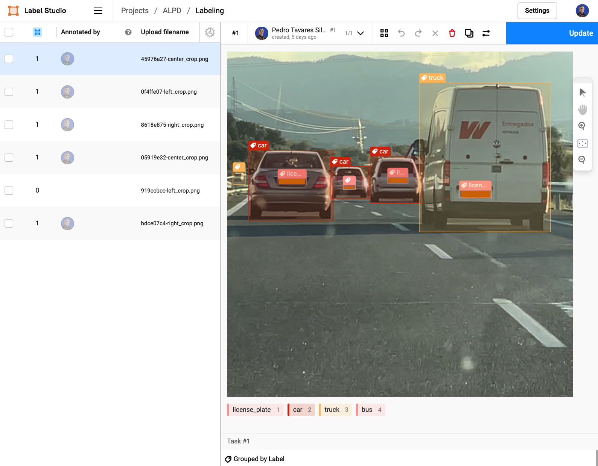

# Automatic License Plate Detection (ALPD)

The objective of this (ongoing) project is to practice computer vision object detection by detecting motor vehicle license plates in motorway videos.

For this project I created a dataset of (1 to 2 minute long) videos shot in a spanish motorway. From this video dataset an image dataset was created and the images annotated with bounding boxes, using [Label Studio](https://github.com/heartexlabs/label-studio).

## directory structure

- /raw : folder with videos
- /frames/train : folder for training images (four of every five videos)
- /frames/validate : folder for validation images (on in every five videos)
- para_anotar : folder where cropped images are saved before importing to Label Studio
