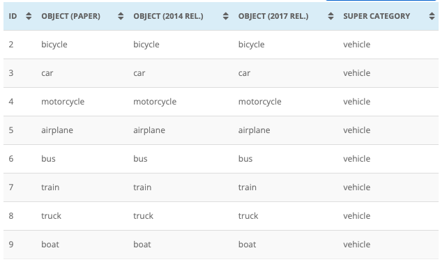

# Automatic License Plate Detection (ALPD)

The objective of this (ongoing) project is to practice computer vision object detection by detecting motor vehicle license plates in motorway videos.

# Creating the dataset

For this project I shot 39 videos (1 to 2 minutes long) in a spanish motorway. 80% of these videos were destined to training YOLOv5 to recognize license plates, cars buses and trucks. The remaining videos were used for validation.

Frames were then extracted at every second of the video, whiche generated 955 images for training and 191 for validation (17% of the total).

As ultirior objetive is to embed the detection code in a Raspberry Pi 4 B for real time detection, YOLOv5s will be trained with 640x640 images.

From each image, three new 640x640 images were created, further augmnenting the dataset to a grand total of 3.434 images.

These images were then annotated with bounding boxes using [CVAT](https://github.com/opencv/cvat) installed on a local machine using Docker.

IMPORTANT: in the Spain license plates are considered Personal Data and therefore the dataset created for this exercise is not published.

# Work in progress

This project is ongoing.

At this stage a prediction was made with YOLOv5s out of the box (see noteblook 03). Since YOLOv5 model was pretrained with COCO, it only recognizes the vehicle classes in that dataset, namely:

The dataset created for this project has a new class (license_plate), as well as the clases car, truck and bus.
